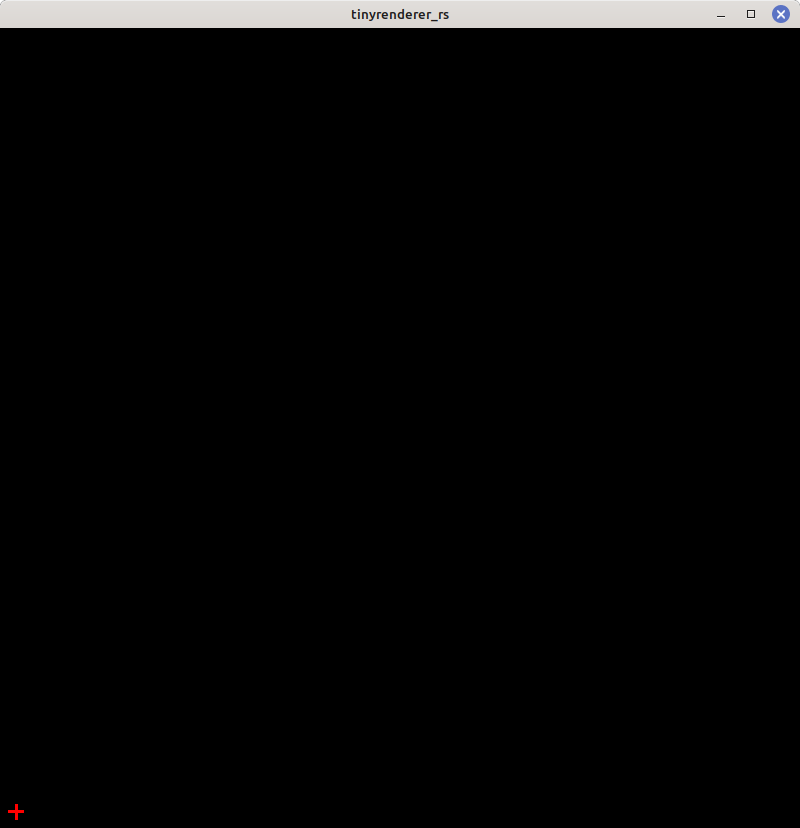
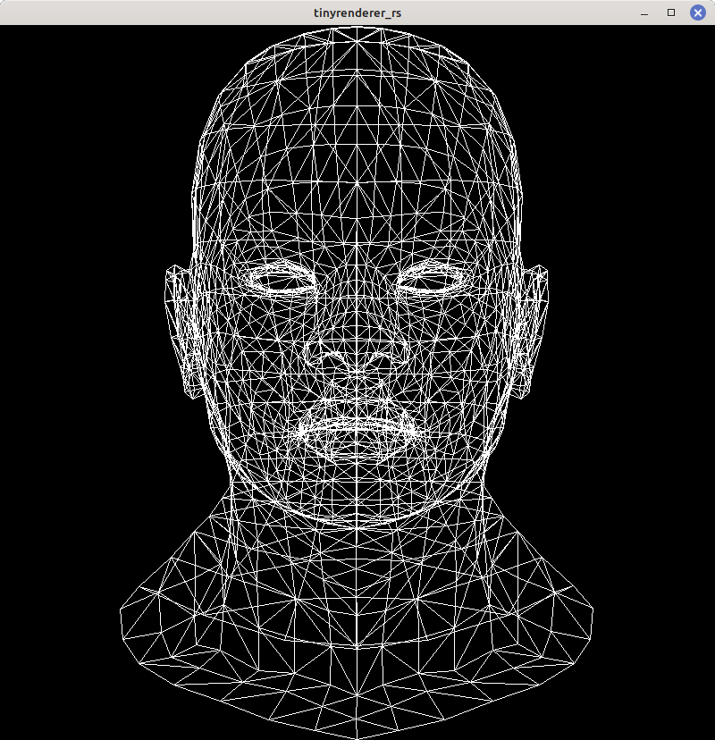
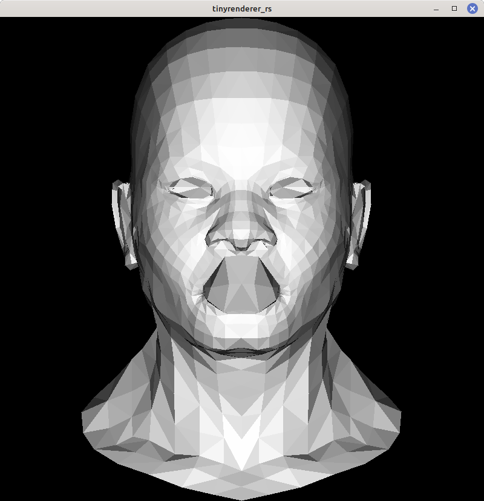
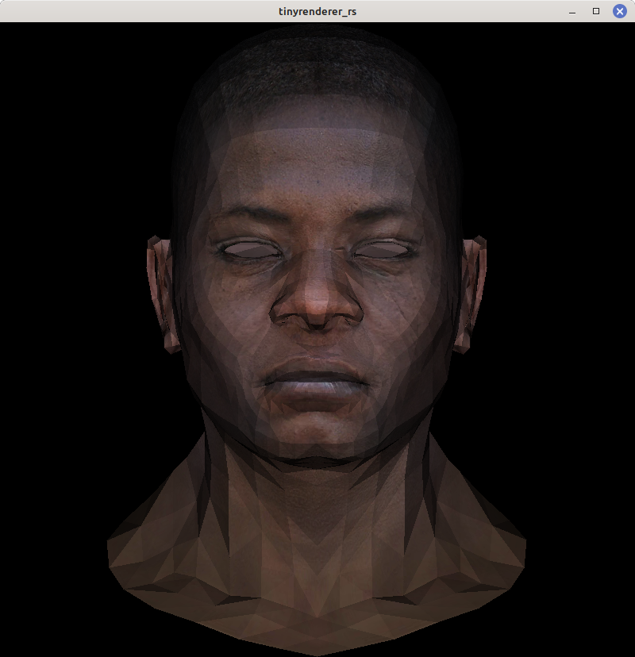
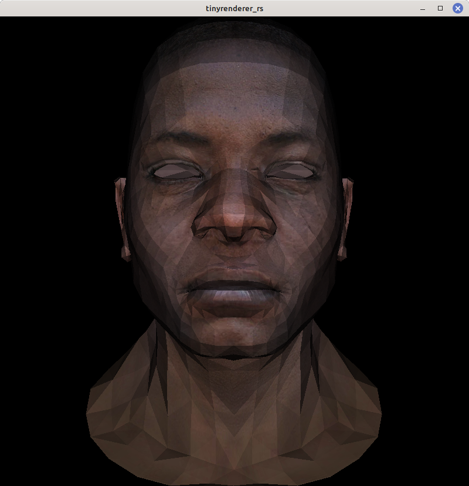
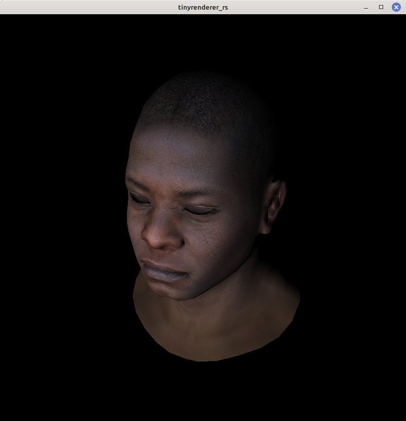
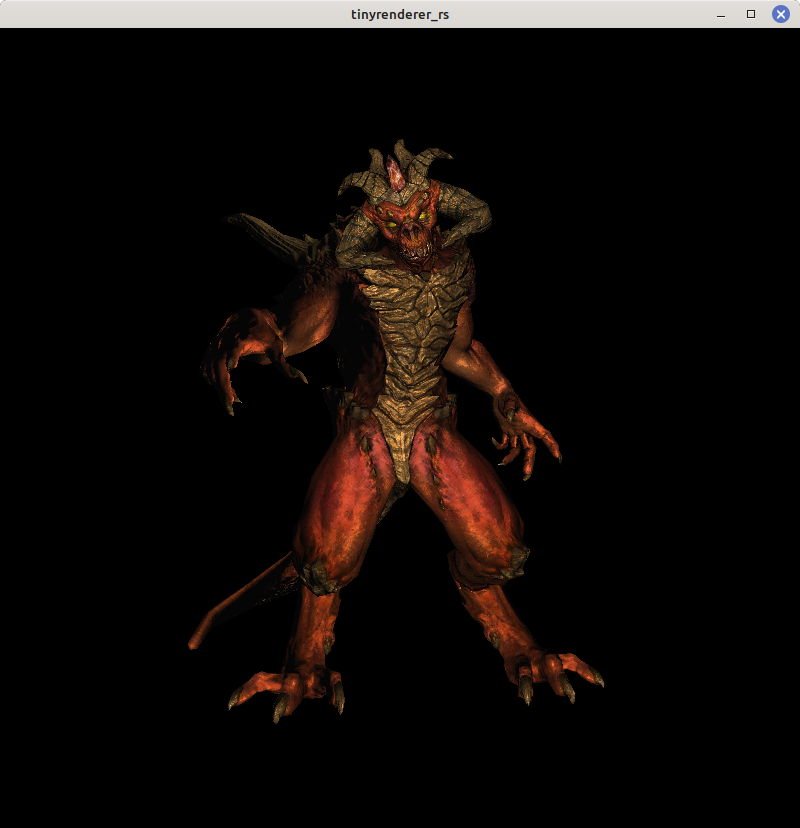
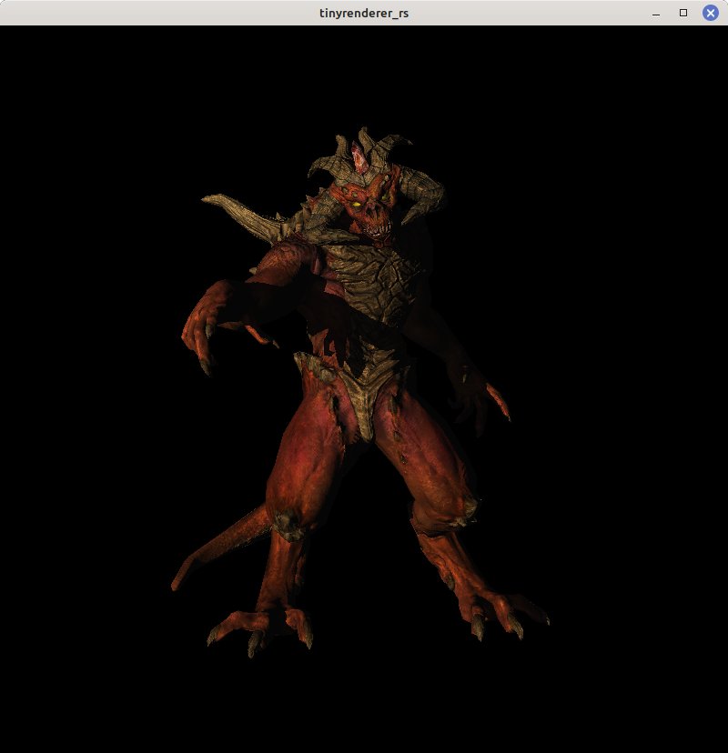
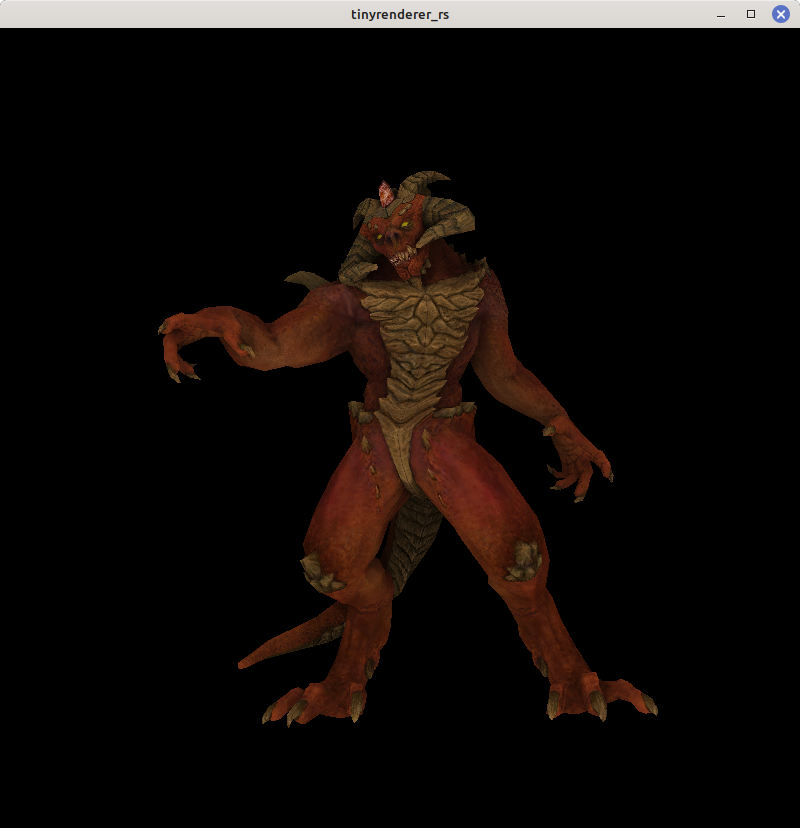
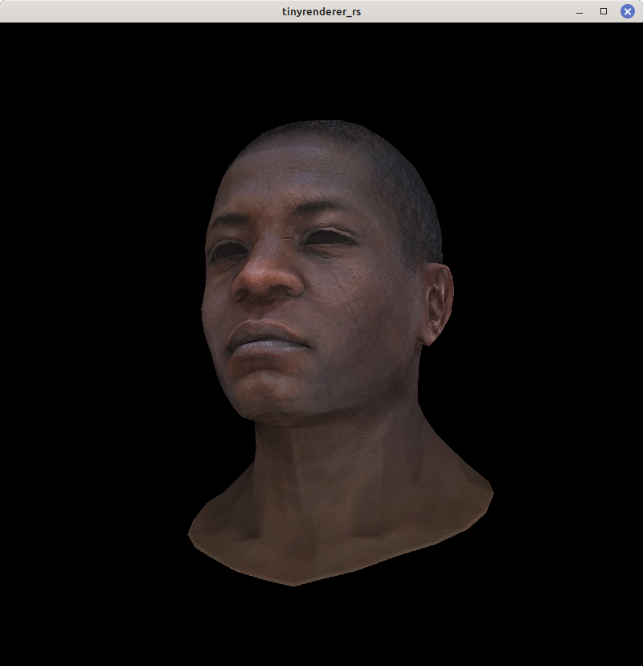

# tinyrenderer_rs
This repo consists of a Rust implementation of the [tinyrenderer](https://github.com/ssloy/tinyrenderer) walkthrough by professor Dmitry V. Sokolov.

## Dependencies:
- image 0.24.5: Image loading and manipulation
- piston_window 1.127.0: Window to display rendered frames 
- obj-rs 0.6: To retrieve information from .obj files
- nalgebra 0.31.4: For vector and matrix calculations

## Usage
To run, just clone any of the branches and do:

```
cargo run --release <assets directory>
```
where `<assets directory>` is the directory in which the corresponding assets of the model are. For example, to run *Lesson 7* you must do:

```
cargo run --release assets/diablo3_pose
```
At the moment, if you want to use other models/textures, you would have to modify the respective assets names in main.


## Lessons

### Lesson 0
Write to an image buffer and render it in a window.

**Branch:** [Lesson_0](https://github.com/ema2159/tinyrenderer_rs/tree/Lesson_0)

**Preview:**

### Lesson 1
Implement Bressenham's line algorithm. Then, use it to draw the wireframe model of a mesh.

**Branch:** [Lesson_1](https://github.com/ema2159/tinyrenderer_rs/tree/Lesson_1)

**Preview:**


### Lesson 2
Implement triangle filling using both line sweeping algorithm and barycentric coordinates algorithm. Then implement a basic directional lighting model, computing the lighting of each triangle face using its normals.

**Branch:** [Lesson_2](https://github.com/ema2159/tinyrenderer_rs/tree/Lesson_2)

**Preview:**


### Lesson 3
Implement Z-buffer algorithm for back-face culling. Then, apply textures to the mesh. 

**Branch:** [Lesson_3](https://github.com/ema2159/tinyrenderer_rs/tree/Lesson_3)

**Preview:**


### Lesson 4
Implement perspective projection.

**Branch:** [Lesson_4](https://github.com/ema2159/tinyrenderer_rs/tree/Lesson_4)

**Preview:**


### Lesson 5
Implement Gouraud shading. Then, implement model view, projection, and viewport transformation matrices. Lastly, apply several transformations to the model through matrices transformation chaining.

**Branch:** [Lesson_5](https://github.com/ema2159/tinyrenderer_rs/tree/Lesson_5)

**Preview:**


### Lesson 6/6bis
Structure code into shaders form. Then, implement texture-based normal mapping for the model, using both global coordinate system normal mapping and Darboux frame normal mapping. Lastly, improve lighting by composing the lighting of the model using ambient, diffuse, and specular lighting (Phong shading).

**Branches:** [Lesson_6](https://github.com/ema2159/tinyrenderer_rs/tree/Lesson_6) [Lesson_6bis](https://github.com/ema2159/tinyrenderer_rs/tree/Lesson_6bis)

**Preview:**


### Lesson 7
Implement hard shadow computation through shadow mapping.

**Branch:** [Lesson_7](https://github.com/ema2159/tinyrenderer_rs/tree/Lesson_7)

**Preview:**


### Lesson 8
Implement screen space ambient occlusion.

**Branch:** [Lesson_8](https://github.com/ema2159/tinyrenderer_rs/tree/Lesson_8)

**Preview:**


